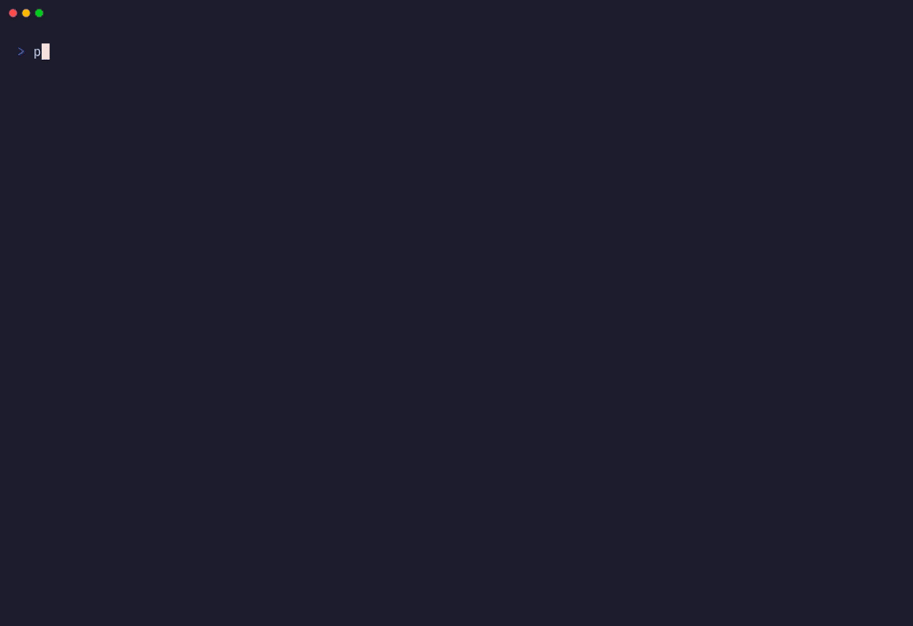

# Tokenectomy Razor 🗡️ — Autonomous Context Surgery & Secret Redaction for AI Agents (M2M MCP Server)

<p align="left">
  <a href="https://tokenectomy-web.vercel.app"></a>
  <a href="https://crates.io/crates/tokenectomy"></a>
  <a href="https://github.com/daffa2555/Tokenectomy/actions/workflows/ci.yml"></a>
  <a href="https://github.com/rustsec/advisory-db"></a>
  <a href="LICENSE"></a>
  <a href="https://modelcontextprotocol.io"></a>
  <a href="https://github.com/daffa2555/tokenectomy-bechmark-history"></a>
  <a href="https://github.com/daffa2555/Tokenectomy"></a>
</p>

> 🌐 **[Interactive Web Playground & Live Architecture →](https://tokenectomy-web.vercel.app)**  
> 🔬 **Need AST Auto-Healing, Test Rollback & Pro Engine? [Tokenectomy Sentinel (Pro Tier) →](https://tokenectomy.gumroad.com/l/kiznsu)**  
> 🔀 **Pair with [Tokenectomy Git (OSS)](https://github.com/daffa2555/tokenectomy-git)** for autonomous Git fix branches & PR creation!  
> 📊 **Telemetry Receipts (25K ➔ 1M Lines):** Check out the transparent **[Benchmark History](https://github.com/daffa2555/tokenectomy-bechmark-history)** repository.  
> 🏷️ **Official MCP Registry:** mcp-name: io.github.daffa2555/razor


<p align="center">
  
</p>

**Tokenectomy Razor 🗡️** (Community / OSS Tier) is an agent-native **Machine-to-Machine (M2M) MCP server** built with Rust. Designed specifically as an autonomous background sub-cortex for AI coding agents (Claude Desktop, Cursor, Cline, Roo Code, Windsurf, Google Antigravity), Razor surgically scrubs 90%+ of internal framework noise (`node_modules`, `site-packages`, `.cargo/registry`) from error logs, auto-redacts sensitive credentials before cloud transmission, and provides sub-millisecond AI reverse proxying—**with zero human babysitting**.

```
                     ┌──────────────────┐
   Agent Error Dump  │   TOKENECTOMY    │      Clean Agent Context
   (38K tokens) ───► │     RAZOR 🗡️     │ ───►  (2K tokens)  ───► LLM Brain
                     │  Community / OSS │
   node_modules/     │  🔍 Smart Filter │      Only YOUR code
   site-packages/    │  🛡️ Redact       │      + error message
   .cargo/registry/  │  💾 Cache        │      + StackOverflow refs
                     └──────────────────┘
```

---

## ✨ Key Features

- **🌐 Polyglot Trace Surgery** — Natively parses stack traces and crashes across **Rust, Python, Node.js/TypeScript/JSX, Golang, Java/Kotlin, C/C++ (ASan & GDB), and PHP (Laravel/Symfony)**, auto-filtering thousands of lines of framework dependency noise (`node_modules`, `site-packages`, `go/src`, `pkg/mod`, `.gradle`, `.m2`, `/usr/include`, `vendor`).
- **🛡️ AI Gateway Reverse Proxy (`--proxy`)** — Intercepts OpenAI/Anthropic/Ollama API traffic locally (`127.0.0.1:8080`), surgically scrubbing prompt token waste and auto-redacting secrets with sub-millisecond latency before forwarding to upstream LLMs.
- **🔍 Smart Framework Filter** — Strips thousands of lines of noisy internal stack frames and preserves strictly the lines of code *you* wrote.
- **🌐 Stack Overflow Search** — Silently queries StackExchange APIs and injects top community solutions into the AI's context.
- **⚡ SHA-256 Response Cache** — Identical errors hit local cache (24h TTL). Recurring CI/CD failures cost $0.00 in API calls.
- **🛡️ Secret Redaction** — Regex engine strips API keys, AWS secrets, JWTs, and database connection strings before any data leaves your machine (ReDoS-safe, linear-time).
- **⚡ High-Throughput Stream Surgery** — Zero-allocation linear-time $O(N)$ evaluation handling 250,000+ lines in ~330ms without memory bloat.
- **🔒 Path Traversal Protection** — MCP file operations are strictly canonicalized and locked within your workspace.
- **🤖 MCP Server Mode** — Full JSON-RPC 2.0 over stdio. Works with Claude Desktop, Cursor, VS Code, Google Antigravity, and any MCP-compatible client.
- **🔌 Multi-Provider** — Supports OpenAI, Anthropic, and Ollama (100% offline mode).

---

## 📊 Verifiable Real-World Performance Benchmark

Every developer can verify the core performance claims directly on their physical machine:

| Feature Under Test | Tested Heavy Input | Real Measured Outcome | Status |
|---|---|---|:---:|
| **Quarter-Million Log Redaction** | **250,000 lines (24.44 MB)** enterprise dump with DB URLs, API keys, JWTs | **333.49 ms (73.3 MB/sec, 749,652 lines/sec)**. 100% sanitized. | ✅ Verified |
| **ReDoS Immunity** | 50,000-character malicious backtracking exploit string | **1.44 ms**. Linear $O(N)$ evaluation, 100% ReDoS immune. | ✅ Verified |
| **High Concurrency Torture** | 100 concurrent OS threads hammering redaction & extractor | **100/100 in 27.35 ms (7,312.7 ops/sec)**. Zero race conditions. | ✅ Verified |
| **Kernel Memory Footprint** | Peak Resident Memory during 250,000-line stress test | **76.24 MB VmRSS** via Linux `/proc/self/status`. Zero memory ballooning. | ✅ Verified |

> 💡 **Verify on your own hardware:** Clone this repository and run the standalone benchmark:
> ```bash
> cargo test --release --test stress_benchmark -- --nocapture
> ```

> 🔬 **Need enterprise workloads (1M+ lines, 250 threads, AST Smart Healer & test rollback)?**  
> Check out **[Tokenectomy Sentinel (Pro Tier) on Gumroad ($9) →](https://tokenectomy.gumroad.com/l/kiznsu)**.

---

## 📦 Installation

### ⚡ Install via Cargo (crates.io)

```bash
cargo install tokenectomy
```

### 🦀 Build from Source

```bash
git clone https://github.com/daffa2555/Tokenectomy.git
cd Tokenectomy
cargo build --release
sudo cp target/release/razor /usr/local/bin/razor
sudo cp target/release/tokenectomy /usr/local/bin/tokenectomy
# Optional alias for backward compatibility:
sudo ln -sf /usr/local/bin/razor /usr/local/bin/tkmy
```

### ⚙️ Install via Smithery (for Claude Desktop)

```bash
npx -y @smithery/cli install tokenectomy --client claude
```

### 🐳 Run via GitHub Container Registry (GHCR)

Pull the multi-arch container image:
```bash
docker pull ghcr.io/daffa2555/razor:latest
```

Or configure your MCP client to run the containerized Razor server directly:
```json
{
  "mcpServers": {
    "tokenectomy": {
      "command": "docker",
      "args": ["run", "-i", "--rm", "ghcr.io/daffa2555/razor:latest", "razor", "--mcp"]
    }
  }
}
```

---

## 🔌 M2M Agent Setup (1-Minute Integration)

Tokenectomy Razor is architected to run silently between your AI Coding Agent and your repository over **JSON-RPC 2.0 stdio**. You configure it once, and your agent autonomously invokes Tokenectomy Razor in the background during debugging and refactoring loops—**no manual copy-pasting or piping required**.

```bash
razor --mcp
# (or legacy alias: tkmy --mcp)
```

### Claude Desktop

Add to `~/Library/Application Support/Claude/claude_desktop_config.json`:

```json
{
  "mcpServers": {
    "tokenectomy": {
      "command": "razor",
      "args": ["--mcp"]
    }
  }
}
```

### Cursor

Add to `.cursor/mcp.json` in your project root:

```json
{
  "mcpServers": {
    "tokenectomy": {
      "command": "razor",
      "args": ["--mcp"]
    }
  }
}
```

### Cline / Roo Code / Windsurf / VS Code

Add to your MCP settings (`settings.json` or `cline_mcp_settings.json`):

```json
{
  "mcpServers": {
    "tokenectomy": {
      "command": "razor",
      "args": ["--mcp"]
    }
  }
}
```

### Google Antigravity CLI

```bash
agy mcp add tokenectomy-razor -- razor --mcp
```

### 🤖 Available M2M MCP Tools

| Tool | Autonomous Agent Role |
|------|-------------|
| `get_error_context` | Performs deep log surgery: strips framework noise, redacts secrets, extracts source context and git diff |
| `search_stack_overflow` | Searches Stack Overflow for a specific error (query is auto-sanitized of secrets) |
| `apply_code_patch` | Applies a code patch to a file by search-and-replace |
 
### 🔀 Companion MCP Server: Tokenectomy Git

Close the autonomous loop from error diagnosis all the way to a published GitHub Pull Request! Pair Tokenectomy Razor with our official companion MCP server: **[Tokenectomy Git](https://github.com/daffa2555/tokenectomy-git)**.

```json
{
  "mcpServers": {
    "tokenectomy": {
      "command": "razor",
      "args": ["--mcp"]
    },
    "tokenectomy-git": {
      "command": "tkmy-git",
      "args": ["--mcp"]
    }
  }
}
```

Together, they enable your AI coding assistant to:
1. Scrub noisy error logs & redact credentials (`tokenectomy`)
2. Generate an accurate fix patch
3. Create a branch, commit files, and open a GitHub PR autonomously (`tokenectomy-git`)

---

## 🛡️ AI Gateway Reverse Proxy Mode (Zero-Config Token Optimization)

Want token reduction without configuring MCP tools? Tokenectomy Razor can run as a **local AI Reverse Proxy Gateway**. It sits transparently between your IDE/agent and upstream LLM providers (OpenAI, Anthropic, Ollama, OpenRouter).

Whenever your agent makes an API call, Tokenectomy Razor intercepts the prompt payload, redacts sensitive credentials, and surgically purges internal framework noise before forwarding the request—streaming the LLM response back with sub-millisecond overhead.

```bash
# Start Gateway Proxy forwarding to OpenAI
razor --proxy --proxy-bind 127.0.0.1:8080 --upstream-url https://api.openai.com/v1

# Or forward to a local Ollama instance
razor --proxy --proxy-bind 127.0.0.1:8080 --upstream-url http://127.0.0.1:11434/v1
```

### Connect Any Agent or Tool in 1 Line:
Point your agent's API base URL to localhost:
```bash
export OPENAI_BASE_URL="http://127.0.0.1:8080/v1"
```
Works out-of-the-box with **Cursor**, **Aider**, **Cline / Roo Code**, **Continue.dev**, **Open-Interpreter**, and any OpenAI SDK client!

---

### 🌐 Polyglot Ecosystem Support Matrix

Tokenectomy Razor features zero-allocation compiled regex trace parsers tailored for production backends:

| Language | Ecosystems & Frameworks | Filtered Framework Noise |
|---|---|---|
| **Rust** | `tokio`, `actix-web`, `axum` | `.cargo/registry`, `.rustup`, `target/debug/build` |
| **Python** | `Django`, `FastAPI`, `PyTorch` | `site-packages`, `dist-packages`, `venv`, `__pycache__` |
| **TypeScript / JS** | `Next.js`, `Vite`, `Express`, `NestJS` | `node_modules`, `.next`, `dist`, webpack internals |
| **Golang** | Goroutine panics, `Gin`, `Fiber` | `go/src` (stdlib), `go/pkg/mod`, `vendor` |
| **Java / Kotlin** | `Spring Boot`, `Quarkus`, JVM exceptions | `.m2/repository`, `.gradle/caches`, `org.springframework` |
| **C / C++** | GDB backtraces, AddressSanitizer (ASan) | `/usr/include`, `/usr/lib`, `vcpkg_installed` |
| **PHP** | `Laravel`, `Symfony`, Fatal errors | `vendor/composer`, `vendor/symfony`, `vendor/laravel` |

---

## 🛠️ Standalone / Local CLI Mode (Optional)

While Tokenectomy Razor is architected for autonomous machine-to-machine agent operation, it also provides a standalone CLI binary (`razor`, backwards-compatible with `tkmy`) if you want to pipe logs in CI/CD pipelines, local shell scripts, or manual debugging:

### Pipe errors directly

```bash
python3 app.py 2>&1 | razor
cargo build 2>&1 | razor
node server.js 2>&1 | razor
# Or using legacy alias:
python3 app.py 2>&1 | tkmy
```

### Read from a log file

```bash
razor --file /var/log/app/error.log
```

### Advanced options

```bash
razor --local-only            # 100% offline via Ollama ($0 cost)
razor --provider openai       # Use OpenAI GPT-4o
razor --provider anthropic    # Use Claude 3.5 Sonnet
razor --context-lines 20      # Extract 20 lines of surrounding context
razor --yes                   # Skip interactive prompts (CI/CD mode)
```

---

## 🧠 Configuration

Create `~/.tokenectomy.toml`:

```toml
default_provider = "openai"  # openai | anthropic | ollama | mock
openai_api_key = "sk-..."
anthropic_api_key = "sk-ant-..."
ollama_base_url = "http://localhost:11434"
context_lines = 10
max_context_chars = 10000
```

---

## 🔒 Security

- **No secrets leave your machine.** Regex engine redacts API keys, JWTs, AWS credentials, and database URLs before any data is sent to an LLM.
- **No path traversal.** MCP file operations are canonicalized and locked to CWD.
- **No stdin bombs.** Input is capped at 10MB (CLI) / 50MB (MCP) via `.take()`.
- **No weak hashing.** Cache uses `sha2::Sha256`, never `DefaultHasher`.

---

## 🏗️ Architecture

```
src/
├── lib.rs           # Core library interface
├── app.rs           # CLI application runner & REPL
├── main.rs          # `tokenectomy` binary entry point
├── bin/             # Standalone binary aliases (`razor`, `tokenectomy-razor`)
├── mcp.rs           # JSON-RPC 2.0 over stdio MCP server
├── proxy.rs         # AI Gateway Reverse Proxy (TCP socket prompt compressor)
├── extractor/       # Polyglot trace parsers (Rust, Python, JS/TS, Go, Java, C++, PHP)
├── provider/        # AI backends (OpenAI, Anthropic, Ollama, Mock test provider)
├── redact.rs        # Secret redaction (linear-time regex, ReDoS-safe)
├── cache.rs         # SHA-256 response cache (24h TTL, 0700 perms)
├── search.rs        # Stack Overflow API integration
└── git.rs           # Recent git diff extraction
```

---

## 🧠 Bundled Open Source Agent Skills

Tokenectomy OSS includes 2 native **Antigravity & Coding Agent Skills** in `.agents/skills/` to elevate your AI assistant's engineering discipline:

| Skill | Description | Location |
|---|---|---|
| **`adversary-bug-hunter`** | Red-team fuzzer that stress-tests edge cases, catches unhandled unwraps/ReDoS, and hardens code. | [`.agents/skills/adversary-bug-hunter/`](.agents/skills/adversary-bug-hunter/SKILL.md) |
| **`spec-first-architect`** | Enforces strict Test-Driven Development (TDD) & state machine invariants to eliminate AI hallucinations. | [`.agents/skills/spec-first-architect/`](.agents/skills/spec-first-architect/SKILL.md) |

---

## 🆓 vs 🔬 — Razor (OSS) vs Sentinel (Pro)

| Feature | 🗡️ Razor (OSS) | 🔬 Sentinel (Pro) |
|---|:---:|:---:|
| Smart Framework Filter | ✅ | ✅ |
| Polyglot Trace Surgery (7 Languages) | ✅ | ✅ |
| Local Reverse Proxy Gateway (`--proxy`) | ✅ | ✅ |
| Stack Overflow Search | ✅ | ✅ |
| SHA-256 Response Cache | ✅ | ✅ |
| Secret Redaction (ReDoS-safe) | ✅ | ✅ |
| MCP Server Mode (JSON-RPC) | ✅ | ✅ |
| Multi-Provider (OpenAI, Claude, Ollama) | ✅ | ✅ |
| Bundled Agent Skills | 2 Skills (Spec TDD & Fuzzer) | Full 4 Skills Suite |
| Anti-Hardcode Secret Shield | ❌ | ✅ |
| AST Syntax Validation (Tree-sitter) | ❌ | ✅ |
| AST Smart Healer (auto-syntax fix) | ❌ | ✅ |
| Code Integrity Guard (Anti-Halu & Anti-Ngide) | ❌ | ✅ |
| Test Verification Loop (Auto-Rollback) | ❌ | ✅ |
| Atomic Multi-File Transactions | ❌ | ✅ |
| Time Machine CAS Undo Engine (`--undo`) | ❌ | ✅ |
| True Ectomy Engine (99% reduction) | ❌ | ✅ |
| DB Inspector & Docker Diagnostics | ❌ | ✅ |
| Reproducible `--benchmark` Mode | ❌ | ✅ |

👉 **[Get Tokenectomy Sentinel on Gumroad ($9) →](https://tokenectomy.gumroad.com/l/kiznsu)**

---

## 📜 License

MIT — see [LICENSE](LICENSE) for details.

---

*Built with 🦀 Rust for maximum performance, strict memory safety, and uncompromising security.*
